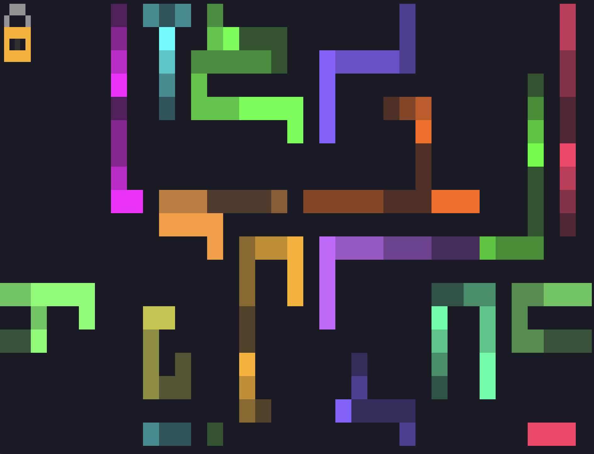

[](https://github.com/retr0h/tlock/releases/latest)
[](https://goreportcard.com/report/github.com/retr0h/tlock)
[](LICENSE)
[](https://github.com/retr0h/tlock/actions/workflows/go.yml)
[](https://github.com/retr0h/tlock/actions/workflows/release.yml)
[](https://github.com/goreleaser)
[](https://github.com/casey/just)
[](https://conventionalcommits.org)

[](https://pkg.go.dev/github.com/retr0h/tlock)


<h1 align="center">
<pre>
____________   _____________________
7      77  7   7     77     77  7  7
!__  __!|  |   |  7  ||  ___!|   __!
  7  7  |  !___|  |  ||  7___|     |
  |  |  |     7|  !  ||     7|  7  |
  !__!  !_____!!_____!!_____!!__!__!
</pre>
</h1>

<p align="center">🔒 Lock your terminal. Unlock with your fingerprint.</p>

A terminal lock screen for macOS that uses **Touch ID** for biometric unlock with **macOS password** fallback. Drop it into tmux as your `lock-command` and walk away.

<table align="center">
  <tr>
    <td align="center" width="33%"><a href="asset/screensaver.png"></a></td>
    <td align="center" width="33%"><a href="asset/passphrase.png"></a></td>
    <td align="center" width="33%"><a href="asset/touchid.png"></a></td>
  </tr>
  <tr>
    <td align="center"><sub>Screensaver</sub></td>
    <td align="center"><sub>Passphrase</sub></td>
    <td align="center"><sub>Touch ID</sub></td>
  </tr>
</table>

## ✨ Features

- 🖐️ **Touch ID** fingerprint unlock via macOS LocalAuthentication
- 🔑 **macOS password** fallback with blinking block cursor
- 🎨 **Glitch-style** unicode bordered prompts (purple/teal palette)
- 🧠 **Auto-detects** Touch ID availability (skips when lid is closed)
- 🛡️ **Signal-proof** — Ctrl+C, Ctrl+Z won't bypass the lock
- 📐 **Terminal resize** aware
- 🖥️ Designed as a **tmux** `lock-command`

## 📦 Install

### ⬇️ Download binary (macOS)

Grab the latest release for your architecture:

```bash
# Apple Silicon (M1/M2/M3/M4)
curl -sL https://github.com/retr0h/tlock/releases/latest/download/tlock_$(curl -sL https://api.github.com/repos/retr0h/tlock/releases/latest | grep tag_name | cut -d '"' -f4 | tr -d v)_darwin_arm64 -o tlock

# Intel Mac
curl -sL https://github.com/retr0h/tlock/releases/latest/download/tlock_$(curl -sL https://api.github.com/repos/retr0h/tlock/releases/latest | grep tag_name | cut -d '"' -f4 | tr -d v)_darwin_amd64 -o tlock

chmod +x tlock
sudo mv tlock /usr/local/bin/
```

### 🔏 Verify checksum

```bash
curl -sL https://github.com/retr0h/tlock/releases/latest/download/checksums.txt -o checksums.txt
shasum -a 256 -c checksums.txt --ignore-missing
```

### 🔨 Build from source

```bash
git clone https://github.com/retr0h/tlock.git
cd tlock
go build -o tlock .
sudo mv tlock /usr/local/bin/
```

## 🚀 Usage

Run directly:

```bash
tlock                                        # Password prompt only
tlock --snake                                # Worms immediately
tlock --screensaver                          # Worms after 30s idle (default delay)
tlock --screensaver --screensaver-delay 60   # Worms after 1 min idle
```

As a tmux lock command:

```tmux
# ~/.tmux.conf
set -g lock-command "tlock --snake"
set -g lock-after-time 1800    # Lock after 30 min idle
bind ^X lock-server            # Ctrl+X to lock now
```

## ⚙️ How It Works

tlock brings the classic [xlock](https://linux.die.net/man/1/xlock) experience to your terminal — an animated screensaver that kicks in when your terminal is locked, with authentication required to dismiss it.

1. 🐍 **Screensaver mode** (`--snake`): xlock-style worms animate across the screen
2. ⌨️ **Any keypress** pauses the screensaver and shows the passphrase prompt
3. 🔑 **Type your macOS password** and press Enter to unlock
4. 🖐️ **Press Esc** to switch to Touch ID — authenticate with your fingerprint
5. 🚫 Wrong password? **ACCESS DENIED** — back to the screensaver

Without `--snake` or `--screensaver`, tlock shows the passphrase prompt directly.

All signals (SIGINT, SIGTERM, SIGTSTP) are ignored. The only way out is authentication. 🔐

## 📋 Requirements

- 🍎 macOS (uses LocalAuthentication.framework and PAM)
- 🐹 Go 1.21+ with CGo enabled
- 🖐️ Touch ID hardware (optional — password fallback always available)

## 💡 Inspiration

tlock is inspired by [xlock](https://linux.die.net/man/1/xlock), the classic X11 screen locker from the 90s that shipped with most Unix workstations. The worm screensaver mode (`xlock -mode worm`) by David Bagley was a staple of SGI Indigos and Sun workstations in dimly lit server rooms everywhere.

## 🔀 Alternatives

| Tool | Platform | Description |
|------|----------|-------------|
| [xlock / xlockmore](https://github.com/zevlg/xlockmore) | X11 / Unix | The OG screen locker with 50+ screensaver modes |
| [vlock](https://github.com/hwhw/vlock) | Linux | Virtual console lock — locks Linux TTYs |
| [bashlock](https://github.com/njhartwell/bashlock) | macOS / Linux | Simple bash-based terminal lock |
| [slock](https://tools.suckless.org/slock/) | X11 | Suckless screen locker — minimal, no frills |

## 🗺️ Roadmap

- [x] 🐛 xlock-style worm screensaver with fading trails
- [ ] 🔤 Additional screensaver modes (cycling figurine text, matrix rain, etc.)
- [ ] ⚙️ Configuration file (`~/.config/tlock/config.yaml`)
- [ ] 🔐 1Password CLI integration

## 📄 License

[MIT](LICENSE) - John Dewey
