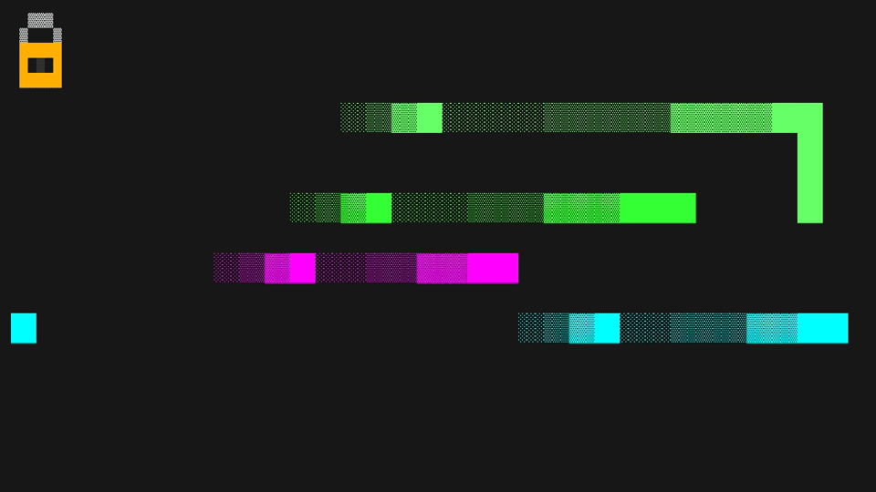
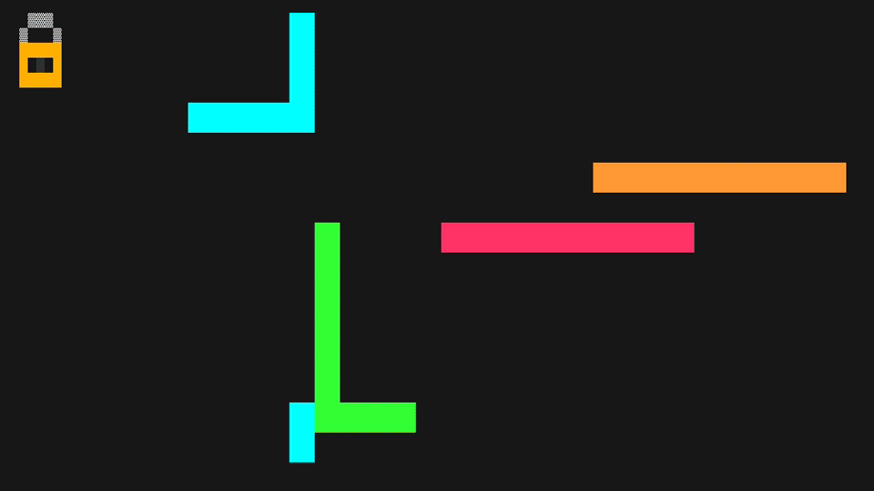

[](https://github.com/retr0h/tlock/releases/latest)
[](https://goreportcard.com/report/github.com/retr0h/tlock)
[](LICENSE)
[](https://github.com/retr0h/tlock/actions/workflows/go.yml)
[](https://github.com/retr0h/tlock/actions/workflows/release.yml)
[](https://github.com/goreleaser)
[](https://github.com/casey/just)
[](https://conventionalcommits.org)

[](https://pkg.go.dev/github.com/retr0h/tlock)


<h1 align="center">
<pre>
____________   _____________________
7      77  7   7     77     77  7  7
!__  __!|  |   |  7  ||  ___!|   __!
  7  7  |  !___|  |  ||  7___|     |
  |  |  |     7|  !  ||     7|  7  |
  !__!  !_____!!_____!!_____!!__!__!
</pre>
</h1>

<p align="center">🔒 Lock your terminal. Unlock with your fingerprint.</p>

A terminal lock screen for macOS that uses **Touch ID** for biometric unlock with **macOS password** fallback. Drop it into tmux as your `lock-command` and walk away.

<table align="center">
  <tr>
    <td align="center" width="33%"><a href="asset/worms.gif"></a></td>
    <td align="center" width="33%"><a href="asset/dvd.gif"></a></td>
    <td align="center" width="33%"><a href="asset/pipes.gif"></a></td>
  </tr>
  <tr>
    <td align="center"><sub>Worms</sub></td>
    <td align="center"><sub>DVD</sub></td>
    <td align="center"><sub>Pipes</sub></td>
  </tr>
</table>

> Recordings generated with [VHS](https://github.com/charmbracelet/vhs):
> `vhs asset/worms.tape` / `asset/dvd.tape` / `asset/pipes.tape`.

## ✨ Features

- 🖐️ **Touch ID** fingerprint unlock via macOS LocalAuthentication
- 🔑 **macOS password** fallback with blinking block cursor
- 🎨 **Glitch-style** unicode bordered prompts (purple/teal palette)
- 🧠 **Auto-detects** Touch ID availability (skips when lid is closed)
- 🛡️ **Signal-proof** — Ctrl+C, Ctrl+Z won't bypass the lock
- 📐 **Terminal resize** aware
- 🖥️ Designed as a **tmux** `lock-command`

## 📦 Install

```bash
curl -fsSL https://github.com/retr0h/tlock/raw/main/install.sh | sh
```

Installs to `~/.local/bin`, `~/bin`, or `/usr/local/bin` (root) — SHA256 checksums verified. Override with `TLOCK_INSTALL_DIR=/some/path` or pin a version with `TLOCK_VERSION=1.1.1`.

<details>
<summary>Manual install</summary>

### ⬇️ Download binary (macOS)

Grab the latest release for your architecture:

```bash
# Apple Silicon (M1/M2/M3/M4)
curl -sL https://github.com/retr0h/tlock/releases/latest/download/tlock_$(curl -sL https://api.github.com/repos/retr0h/tlock/releases/latest | grep tag_name | cut -d '"' -f4 | tr -d v)_darwin_arm64 -o tlock

# Intel Mac
curl -sL https://github.com/retr0h/tlock/releases/latest/download/tlock_$(curl -sL https://api.github.com/repos/retr0h/tlock/releases/latest | grep tag_name | cut -d '"' -f4 | tr -d v)_darwin_amd64 -o tlock

chmod +x tlock
sudo mv tlock /usr/local/bin/
```

### 🔏 Verify checksum

```bash
curl -sL https://github.com/retr0h/tlock/releases/latest/download/checksums.txt -o checksums.txt
grep "$(uname -s | tr A-Z a-z)_$(uname -m | sed 's/x86_64/amd64/;s/aarch64/arm64/')" checksums.txt | sed 's/tlock_.*$/tlock/' | shasum -a 256 -c
```

</details>

### 🔨 Build from source

```bash
git clone https://github.com/retr0h/tlock.git
cd tlock
go build -o tlock .
sudo mv tlock /usr/local/bin/
```

## 🚀 Usage

Run directly:

```bash
tlock                          # Password prompt only
tlock --worms                  # Worms screensaver
tlock --pipes                  # Pipes screensaver
tlock --dvd                    # Bouncing lock screensaver
tlock --random                 # Random screensaver
tlock --random --cycle 5m      # Rotate screensaver every 5 min
tlock --worms --delay 30s      # Worms after 30s idle
```

### 🖥️ Tmux integration

tlock ships as a **tmux plugin**. One line in `~/.tmux.conf` wires
tmux's native lock machinery (`lock-command`, `lock-after-time`, and
a manual `lock-server` keybind) to tlock with sensible defaults.

#### Install via [TPM](https://github.com/tmux-plugins/tpm) (recommended)

```tmux
set -g @plugin 'retr0h/tlock'
```

Then `<prefix> I` inside tmux to install. You can now remove any
standalone `set -g lock-command ...` and `set -g lock-after-time ...`
lines — the plugin owns them.

#### Configurable options

```tmux
set -g @tlock-binary   '/custom/path/to/tlock'  # override binary location
                                                # (default: ~/.local/bin/tlock,
                                                # falls back to $PATH lookup)
set -g @tlock-args     '--random --cycle 5m'    # flags passed to tlock
set -g @tlock-timeout  '1800'                   # lock-after-time in seconds
                                                # (0 disables auto-lock)
set -g @tlock-key      'C-x'                    # <prefix> + this key to lock now
```

#### Manual install (no TPM)

If you don't use TPM, drop the equivalent into your `~/.tmux.conf`
yourself:

```tmux
set -g lock-command "tlock --random --cycle 5m"
set -g lock-after-time 1800    # Lock after 30 min idle (0 = disabled)
bind C-x lock-server           # <prefix> + Ctrl+X to lock now
```

> **Note:** you still need the `tlock` binary on `$PATH` — the tmux plugin
> only wires up tmux.

## ⚙️ How It Works

tlock brings the classic [xlock](https://linux.die.net/man/1/xlock) experience to your terminal — an animated screensaver that kicks in when your terminal is locked, with authentication required to dismiss it.

1. 🎨 **Pick a screensaver** — `--worms`, `--pipes`, `--dvd` (bouncing lock), or `--random`
2. ⌨️ **Any keypress** pauses the screensaver and shows the passphrase prompt
3. 🔑 **Type your macOS password** and press Enter to unlock
4. 🖐️ **Press Esc** to switch to Touch ID — authenticate with your fingerprint
5. 🚫 Wrong password? **ACCESS DENIED** — back to the screensaver
6. 🔄 **Cycle mode** — `--random --cycle 5m` rotates screensavers automatically

Without a screensaver flag, tlock shows the passphrase prompt directly.

All signals (SIGINT, SIGTERM, SIGTSTP) are ignored. The only way out is authentication. 🔐

## 📋 Requirements

- 🍎 macOS (uses LocalAuthentication.framework and PAM)
- 🐹 Go 1.21+ with CGo enabled
- 🖐️ Touch ID hardware (optional — password fallback always available)

## 💡 Inspiration

tlock is inspired by [xlock](https://linux.die.net/man/1/xlock), the classic X11 screen locker from the 90s that shipped with most Unix workstations. The worm screensaver mode (`xlock -mode worm`) by David Bagley was a staple of SGI Indigos and Sun workstations in dimly lit server rooms everywhere.

## 🔀 Alternatives

| Tool | Platform | Description |
|------|----------|-------------|
| [xlock / xlockmore](https://github.com/zevlg/xlockmore) | X11 / Unix | The OG screen locker with 50+ screensaver modes |
| [vlock](https://github.com/hwhw/vlock) | Linux | Virtual console lock — locks Linux TTYs |
| [bashlock](https://github.com/njhartwell/bashlock) | macOS / Linux | Simple bash-based terminal lock |
| [slock](https://tools.suckless.org/slock/) | X11 | Suckless screen locker — minimal, no frills |

## 🗺️ Roadmap

- [x] 🪱 xlock-style worm screensaver with fading trails
- [x] 🔒 Bouncing DVD padlock screensaver
- [x] 🔲 Pipes screensaver with fade-out reset
- [x] 🎲 Random screensaver selection with `--cycle` rotation
- [ ] 🔐 1Password CLI integration

## 📄 License

The [MIT][] License.

[MIT]: LICENSE
